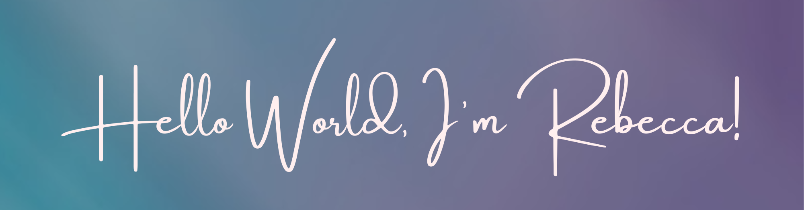
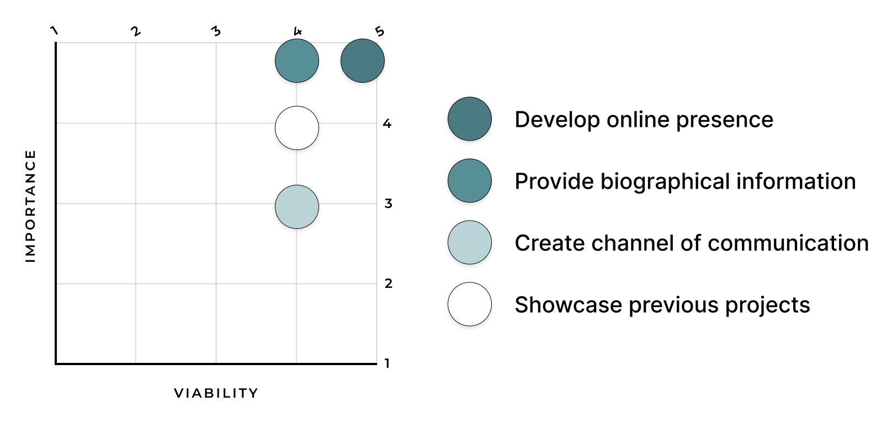
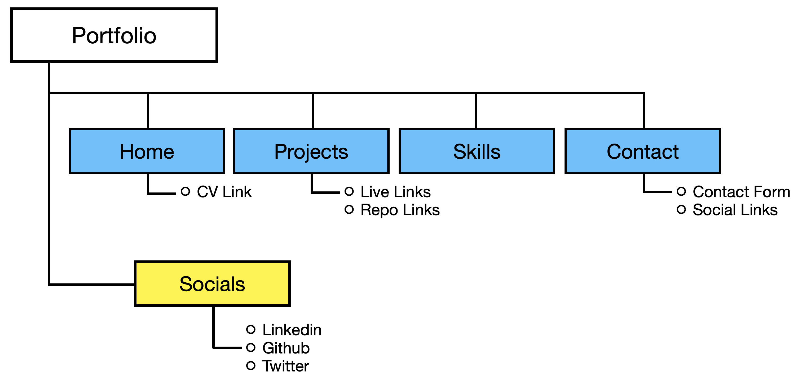
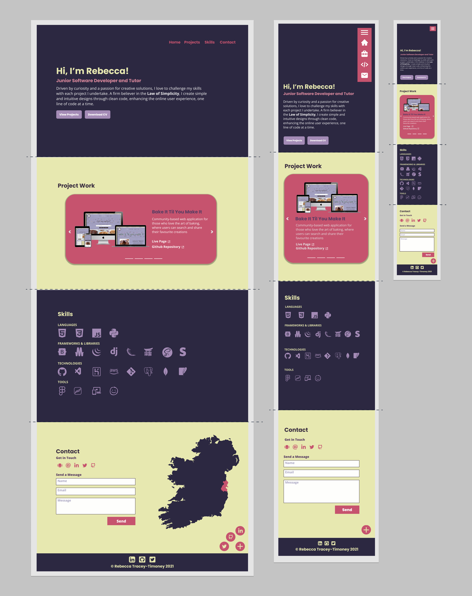
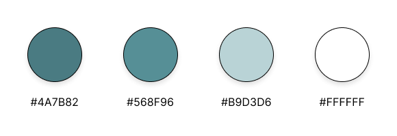
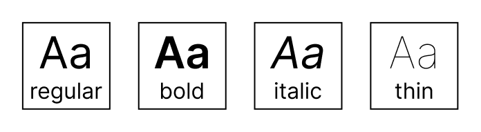

### Welcome to my Portfolio!
This repository showcases my skills, expertise, and experiences as a UX Designer and Developer. As a UX Engineer, I bridge the gap between design and development, creating seamless and interactive user experiences through the integration of front-end development and UX design principles.

***

## UX 

### User Stories
#### As a visitor, I want to:
1. Easily navigate through the website to find the relevant content, effortlessly.
2. Download a copy of the developer's paper CV to find relevant information.
3. Easily navigate to previous projects of the developer, to learn about their style of work.
4. Easily find a point of contact in order to get in touch with the developer.

### Development Planes

The developer distinguished the required functionality of the site and how it would answer the user stories, as described above, using the Five Development Planes:

#### Strategy
Broken into three categories, the website will focus on the following target audiences:
- **Roles:**
     - New/Potential Clients
     - Current/Return Clients

- **Demographic:**
     - Potential Employers/Contractors
     - Interest in collaborating with the developer

- **Psychographics:**
     - Personality & Attitudes:
          - Friendly
          - Outgoing
     - Values:
          - More modern lifestyle
          - Importance of online presence
     - Lifestyles:
          - Business-oriented
          - Client-focused

The website needs to enable the **user** to:
- Retrieve desired information:
     - CV
     - Information on previous projects
     - Contact information

The website needs to enable the **developer** to:
- Develop an online presence 
- Provide an easily navigable website for users to find relevant information:
     - Projects
     - CV
- Provide a channel of communication for enquires

With these goals in mind, a strategy table was created to determine the trade-off between importance and viability with the following results:

#### Scope
A scope was defined in order to clearly identify what needed to be done in order to align features with the strategy previously defined. This was broken into two categories:
- **Content Requirements**
     - The user will be looking for:
          - Biographic information
          - Projects
          - Contact details
          - Downloadable CV
- **Functionality Requirements**
     - The user will be able to:
          - Easily navigate through the site in order to find the information they want
          - Easy access to downloadable CV
          - Contact the developer directly through their chosen channel of communication

#### Structure
The information architecture was organized in a **hierarchial tree structure** in order to ensure that users could navigate through the site with ease and efficiency, with the following results: 

#### Skeleton 
High-Fidelity Wireframe mockups were created in [Figma Workspace](https://www.figma.com/file/CImNeXCAVsJVcCnhKufeO9/Portfolio?node-id=104%3A194 "Link to Portfolio Workspace") with providing a positive user experience in mind:

#### Surface

**Colour Scheme**

The combination of blue and green shades creates a harmonious and calming colour palette. Aligning with the Developer's brand identity, the following palette was thoughtfully crafted to create a visually appealing, user-friendly, and accessible interface:

**Typography**

The font [Inter](https://fonts.google.com/specimen/Inter "Link to Inter Google Fonts page") was carefully chosen for this project due to its versatility, readability, and modern aesthetic. Its clean and minimalistic design brings a contemporary feel to the interface, while its subtle character adds personality and uniqueness to the overall design.

**Imagery**

The imagery used was created by the developer using [Procreate](https://procreate.art/ "Link to Procreate") and [Figma](https://www.figma.com/ "Link to Figma") in order to create a consistency of the elements while maintaining the look and feel of the application.

[Back to top ⇧](#table-of-contents)
